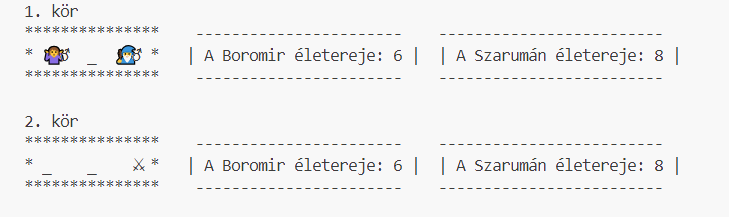
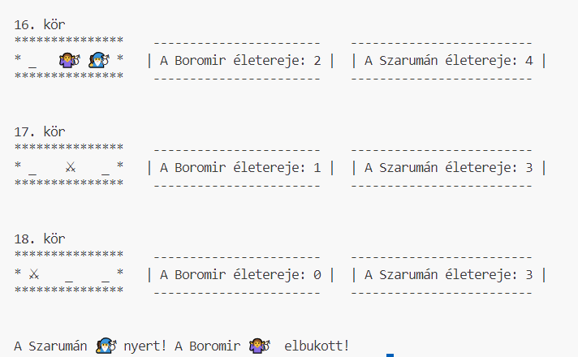

# Harcos és a Varázsló

## A játék leírása

A játékban van egy harcos és egy varázsló, akik minden körben egy 3 elemű játéktéren léphetnek véletlenszerűen egy mezőre. 
Amennyiben ugyanarra a mezőre lépnek, akkor harcolnak. 

Kezdetben mindkét játékos életerejét véletlenszerűen határozzuk meg egy 6 oldalú kocka dobásával. A minimális életerőpont 3 lehet, ehhez adjuk a kockadobás eredményét. 

A játék során minden körben váletlenszerűen változik a játékosok pozíciója ([0,2] zárt intervallumban)

A harc azt jelenti, hogy az éelterejük 0-val, vagy 1-gyel csökken. 

## Feladatok

1. Hozz létre Játékos osztályt.  A játékos a nevét, a karakterét jelölő figurát, és a kezdeti pozícióját példányosításkor kapja. Ne felejtsük el a fenti leírásnak megfelelően beállítani az életerejét!
2. Adott egy lista, mely reprezetnálja a játéktér állapotát. pl. lista["🧙‍♂️"," _",  "🤷‍♂️"]
3. Hozz létre kiir() metódust. Ennek feladata, hogy kiírja a játék aktuális állapotát a mintának megfelelően!
   
4. A listabeallit metódus feladata, hogy a listába elhelyezze a megfelelő karaktereket. 
5. A harc metódus feladata, hogy vezérelje a harcot. 

A játéknak akkor van vége, ha valamelyik játékos életereje 0, vagy 0 alá csökken. Írjuk ki a győztest!

